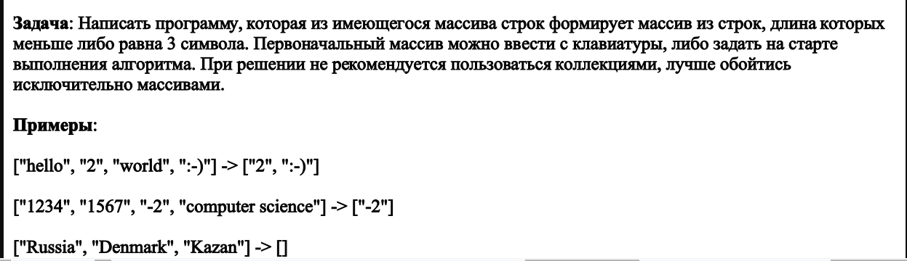
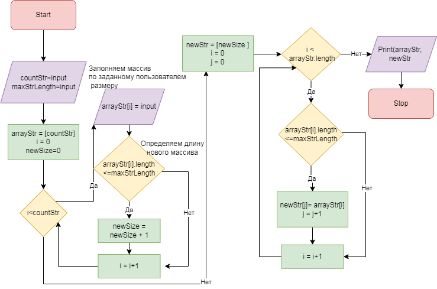

# FinalWork_IntroductionIT_GB

## Дана Задача:

### Блок-схема общего алгоритма решения задачи представлена на рисунке ниже:

В своем решении предлагаю два варианта, не пользуясь списками и прочими коллекциями:

1. **_Первый вариант._** Если идти по пути максимальной декомпозиции задачи - каждую подзадачу выделяю в отдельный метод.

А именно:

+ Задаем массив через функцию. Запрашиваем у пользователя размер массива и записываем строки в элементы массива, пока не достигнем указанного размера.

+ Далее описываю функцию, которая перебирает все строки заданного массива, находит и возвращает требуемую по условию длину нового массива - т.е. ищет число строк, соответствующих условию длины строки.

+ Третья функция создает новый массив с найденным размером и заполняет его строками, которые соответствуют условию.

**См. проект Task_FinalWork**
***
2. **_Второй вариант._** Он более соответствует предложенной блок-схеме, нацелен на сокращение числа итераций:

+ На входе мы получаем значение размера первоначального массива и чему равно ограничение длины.

+ В глобальной области, не вынося в отдельный метод, задаем массив и тут же через условие определяем размер нового массива - в соответствии с условием длины строки.

+ Для формирования результирующего массива описываю метод, как и первом варианте, который при вызове получает параметры: заданный первоначальный массив, размер нового массива, ограничение длины. И возвращает новый массив согласно вводным данным.

**См. проект Task_FinalWork_V2**
***

Для достижения универсальности избегаю использование *"магических чисел"*, во всех операциях и методах применяю переменные, значения которых вводятся пользователем либо можно задать непосредственно при вызове метода.